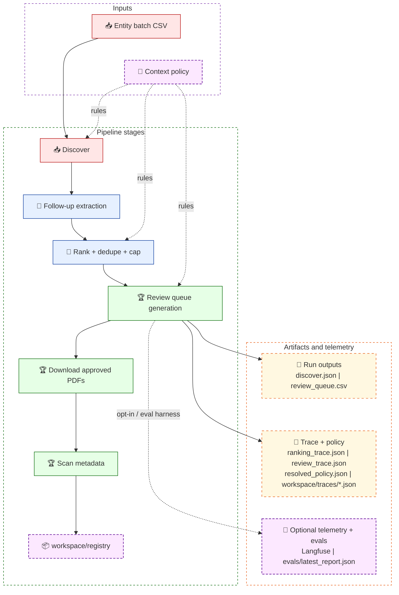
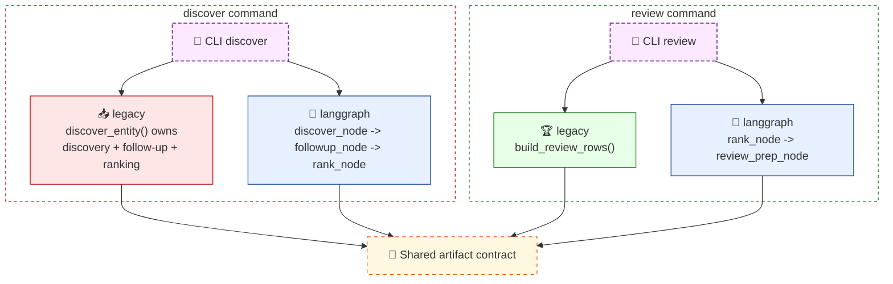

# Document Acquisition Workbench

`doc_workbench` is a public-safe reconstruction of a production document acquisition pipeline.
It is designed for architectural review more than feature demo: deterministic artifact contracts,
policy-driven decisioning, registry-backed downloads, installable evals, and an optional
LangGraph execution path with safe opt-in observability.

## Why This Repo Is Worth Reviewing

| Signal | Why it matters to a technical lead |
|---|---|
| Two execution models, one contract | The default legacy path and the LangGraph path produce the same core output filenames, so orchestration can evolve without breaking downstream consumers. |
| Policy-driven ranking and review | Discovery and review share the same packaged context policy, which keeps source-priority and recommendation logic consistent across CLI runs, installs, and evals. |
| Local-first traceability | Every run writes local JSON traces plus decision sidecars such as `ranking_trace.json` and `review_trace.json`. |
| Safe remote telemetry | Langfuse is explicit opt-in, credentials-gated, URL-sanitized, and suppressed during eval runs. |
| Packaging discipline | Policy files and eval fixtures ship inside the installed package, so the CLI works after `pip install` without depending on the source tree. |

## Architecture At A Glance



This is the core idea the repo is trying to show: acquisition is not just scraping. It is a staged pipeline with explicit policy, reviewable outputs, persistent state, and observable execution.

> Architecture deep dive: [`docs/architecture.md`](docs/architecture.md) documents the system view, execution-path differences, runtime artifacts, observability model, and extension points.

## Execution Modes



| Path | Default | What it does | Notes |
|---|---|---|---|
| `legacy` | Yes | Direct async CLI orchestration | Stable baseline path |
| `langgraph` for `discover` | No | Compiled graph: `discover_node -> followup_node -> rank_node` | Requires `.[orchestration]` |
| `langgraph` for `review` | No | Direct node calls: `rank_node -> review_prep_node` | Does not import `graph.py`; can run without the orchestration extra |

Set the engine explicitly with `--engine langgraph`, or use `DOC_WORKBENCH_ENGINE=langgraph`. The explicit CLI flag wins.

## Quick Start

```bash
python -m venv .venv
. .venv/bin/activate

# Core install
python -m pip install -e ".[dev]"

# Add LangGraph orchestration
python -m pip install -e ".[dev,orchestration]"

# Add optional Langfuse remote tracing
python -m pip install -e ".[dev,orchestration,observability]"
```

### Docker

```bash
docker build -t doc-workbench .
docker run --rm -it -v "$PWD:/app" doc-workbench paths
```

Bind-mounting the repo keeps `workspace/` outputs on the host and makes repo-relative inputs such as `examples/` available inside the container.

## CLI Surface

```bash
doc-workbench paths
doc-workbench discover --entities examples/public_companies.csv --followup-search
doc-workbench followup-search --input workspace/runs/discover_*/discover.json
doc-workbench review --input workspace/runs/discover_*/discover.json
doc-workbench download --input workspace/runs/review_*/review_queue.csv
doc-workbench scan --all
doc-workbench eval
```

### Typical end-to-end run

```bash
doc-workbench discover --entities examples/public_companies.csv --followup-search --engine langgraph
doc-workbench review --input workspace/runs/discover_*/discover.json --engine langgraph
doc-workbench download --input workspace/runs/review_*/review_queue.csv
doc-workbench scan --all
```

The bundled sample dataset lives in [`examples/public_companies.csv`](examples/public_companies.csv).

## Artifact Contract

One of the strongest design signals in this repo is that downstream artifacts stay stable even when the execution model changes.

| Command | Core outputs | Why they exist |
|---|---|---|
| `discover` | `discover.json`, `discover_summary.csv`, `ranking_trace.json`, `resolved_policy.json`, trace file | Candidate pool snapshot plus ranking explainability |
| `review` | `review_queue.csv`, `review_trace.json`, `resolved_policy.json`, trace file | Human-review handoff with recommendation rationale |
| `download` | downloaded files plus registry manifests | Persistent local registry for approved artifacts |
| `scan` | updated manifest metadata | Lightweight PDF metadata enrichment |
| `eval` | `evals/latest_report.json` | Regression signal for ranking and recommendation behavior |

## Policy, Explainability, And Observability

### Context policy

The acquisition policy is bundled inside the package at `doc_workbench/context/context_policy.yaml`. The runtime loads it via `importlib.resources`, so installed users get the same policy behavior without needing the source tree. The root-level `context/` directory is just a contributor-readable copy.

```yaml
acquisition_order:
  - official_site
  - regulatory_filings
  - search_expansion
  - followup_extraction
```

Every `discover` and `review` run writes a `resolved_policy.json` sidecar so the exact policy used for that run is preserved next to the outputs.

### Decision traces

Discovery and review both emit explainability sidecars:

| File | Purpose |
|---|---|
| `ranking_trace.json` | Shows candidate scoring inputs and final confidence |
| `review_trace.json` | Shows confidence band, reason codes, and recommendation |

### Observability model

Two observability layers run in parallel:

| Layer | Behavior |
|---|---|
| Local traces | Always on. JSON spans are written under `workspace/traces/` for discovery, follow-up, ranking, and review stages. |
| Langfuse remote traces | Optional. Enabled only when the explicit opt-in gate and credentials are both present. |

```bash
export DOC_WORKBENCH_ENABLE_LANGFUSE=1
export LANGFUSE_SECRET_KEY=sk-...
export LANGFUSE_PUBLIC_KEY=pk-...
export LANGFUSE_HOST=https://cloud.langfuse.com
```

If those variables are absent, the workbench keeps running with local traces only. No crash. No warning spam.

Important observability guarantees:

- Remote Langfuse spans are emitted only by the LangGraph path.
- Eval runs suppress Langfuse even if the environment is configured for remote tracing.
- Telemetry URLs are sanitized before remote emission so embedded credentials are never forwarded.

## Evals

The eval harness ships inside the package at `doc_workbench/evals/`, so it works after installation without the source tree.

```bash
doc-workbench eval
python -m doc_workbench.evals.run_evals

# Source-tree convenience shim
python evals/run_evals.py
```

Output: `evals/latest_report.json`

Per-fixture metrics:

- `candidate_recall`
- `top_ranked_correct`
- `top_recommendation_correct`

## Where To Look First

| If you care about... | Start here |
|---|---|
| Provider orchestration and public acquisition flow | `doc_workbench/acquisition/discovery.py` |
| LangGraph node boundaries and state handoff | `doc_workbench/orchestration/nodes.py` and `doc_workbench/orchestration/graph.py` |
| Policy packaging and runtime loading | `doc_workbench/policy.py` and `doc_workbench/context/` |
| Safe remote observability | `doc_workbench/observability/langfuse_bridge.py` |
| Review classification and queue building | `doc_workbench/review/workflow.py` |
| Installable regression harness | `doc_workbench/evals/run_evals.py` |

## Public-Safe Boundaries

What this repo preserves from the production pattern:

- module boundaries and staged execution flow
- provider abstraction and fallback acquisition strategy
- policy-driven ranking and review
- registry-backed persistence
- trace and artifact lifecycle

What is intentionally generalized or removed:

- proprietary business rules
- internal datasets
- rollout logic and operational controls tied to private infrastructure
- company-specific storage conventions

## More Detail

- Architecture reference: [`docs/architecture.md`](docs/architecture.md)
