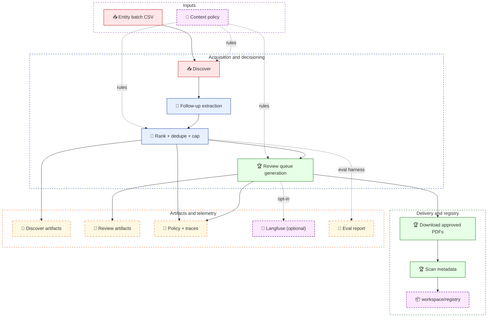
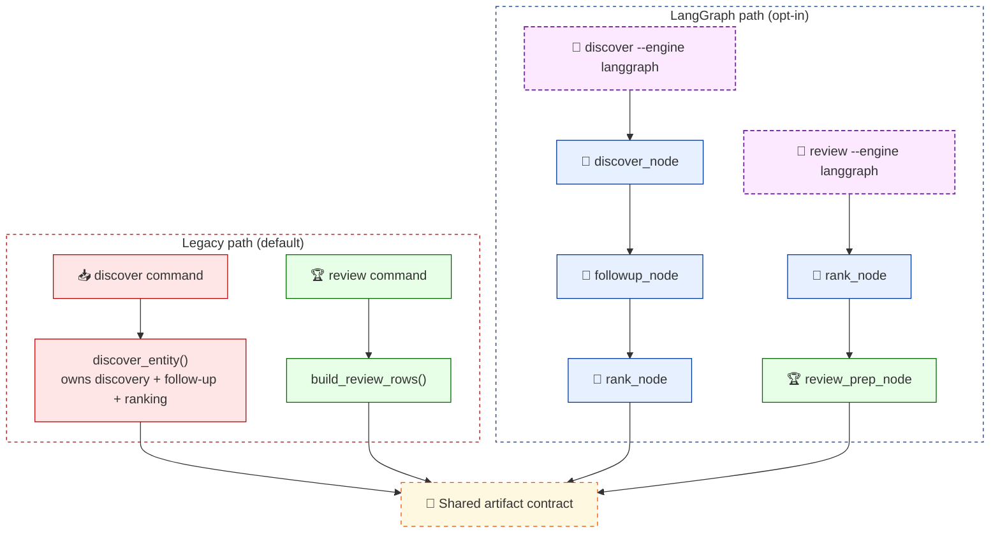

# Document Acquisition Workbench Architecture

`doc_workbench` is a public-safe reconstruction of a production document acquisition workflow.
The interesting part is not the scraping itself. The interesting part is the contract around it:
stable artifacts, policy-driven decisioning, explicit review, local-first persistence, optional
orchestration, and safe observability.

## Architectural Intent

This repository is designed to demonstrate five things:

- acquisition as a staged pipeline, not a one-shot crawler
- execution-model swapability without downstream artifact drift
- policy packaged as runtime data rather than hardcoded branch logic everywhere
- reviewable outputs and trace sidecars at every decision boundary
- safe opt-in remote telemetry without making local development fragile

## System View

## Execution Models

The repo supports two execution models that intentionally converge on the same core output contract.

### Path Comparison

| Concern | Legacy | LangGraph |
|---|---|---|
| Default path | Yes | No |
| `discover` implementation | `acquisition/discovery.py::discover_entity()` | `discover_node -> followup_node -> rank_node` |
| `review` implementation | `review/workflow.py::build_review_rows()` | `rank_node -> review_prep_node` |
| Compiled graph usage | No | Yes for `discover`; no for `review` |
| Optional dependency | none | `langgraph` only for compiled discover graph |
| Output filenames | same contract | same contract |

Important nuance:

- `discover --engine langgraph` stops at `rank -> END`; it does **not** run `review_prep_node`.
- `review --engine langgraph` calls node functions directly and does **not** execute a compiled `StateGraph`.
- Internal full-mode execution exists as `run_graph(mode="full")` for cases that need `review_prep` in the same stateful flow.

## Command-to-Module Map

| CLI command | Main module path | Notes |
|---|---|---|
| `discover` | `doc_workbench/acquisition/discovery.py` or `doc_workbench/orchestration/*` | Provider acquisition, follow-up, ranking |
| `followup-search` | `doc_workbench/followup/workflow.py` | Materializes promoted targets into the registry |
| `review` | `doc_workbench/review/workflow.py` or orchestration nodes | Produces review queue and review trace |
| `download` | `doc_workbench/storage/downloader.py` + `doc_workbench/registry/document_registry.py` | Fetches approved PDFs and records registry state |
| `scan` | `doc_workbench/registry/metadata_scanner.py` | Adds lightweight PDF metadata to manifests |
| `eval` | `doc_workbench/evals/run_evals.py` | Reuses real ranking/review node logic |

## State Model

The LangGraph path threads a shared `WorkbenchState` through all nodes.

| Field | Set by | Meaning |
|---|---|---|
| `entities` | caller | input entity records |
| `policy` | caller | loaded `ContextPolicy` |
| `tracer` | caller | local trace collector |
| `output_dir` | caller | run-scoped artifact directory |
| `followup_search` | caller | whether follow-up logic is enabled |
| `discovery_records` | `discover_node` | pre-follow-up / pre-rank candidate pool |
| `followup_records` | `followup_node` | candidate pool after follow-up enrichment |
| `ranked_records` | `rank_node` | rescored, deduped, capped candidates |
| `review_rows` | `review_prep_node` | final review queue |
| `review_trace` | `review_prep_node` | review explainability payload |
| `recommendation_summary` | `review_prep_node` | aggregate recommendation counts |

## Artifact Surfaces

Artifact stability is one of the strongest architectural choices in the repo.

| Stage | Primary artifacts | Why they exist |
|---|---|---|
| Discover | `discover.json`, `discover_summary.csv`, `ranking_trace.json`, `resolved_policy.json` | freeze candidate pool and ranking rationale |
| Review | `review_queue.csv`, `review_trace.json`, `resolved_policy.json` | hand off a reviewable queue with recommendation reasons |
| Trace | `workspace/traces/{run_id}.json` | local execution record independent of remote telemetry |
| Registry | `workspace/registry/*` | persistent downloaded-document state |
| Eval | `evals/latest_report.json` | machine-readable regression report |

The artifact filenames are intentionally stable across execution models so downstream consumers do not care whether the run was legacy or LangGraph-backed.

## Observability Model

Two observability layers run in parallel:

| Layer | Behavior |
|---|---|
| Local JSON traces | Always on. Written under `workspace/traces/` for all runs. |
| Langfuse remote spans | Optional. Only active when explicit opt-in and credentials are both present. |

### Local traces

`RunTrace` records stage-level spans for the acquisition workflow and writes them to disk with the run ID.

Key semantic detail:

- legacy `discover` emits the authoritative `discover_entity` span from `acquisition/discovery.py`
- LangGraph emits a distinct pre-rank span name, `discover_entity_pre_rank`, to avoid pretending that pre-rank discovery is the same thing as the legacy final discover stage
- follow-up, ranking, and review use canonical stage names such as `followup_extraction`, `candidate_ranking`, and `review_queue_generation`

### Remote telemetry guardrails

`doc_workbench/observability/langfuse_bridge.py` is intentionally conservative:

- requires `DOC_WORKBENCH_ENABLE_LANGFUSE=1`
- requires `LANGFUSE_SECRET_KEY` and `LANGFUSE_PUBLIC_KEY`
- falls back to a no-op client on any missing gate or SDK failure
- sanitizes URLs before remote emission so embedded credentials are never forwarded
- is suppressed entirely during `doc-workbench eval`

Remote Langfuse spans are produced only by the LangGraph path.

## Policy And Decisioning

The acquisition policy is bundled at `doc_workbench/context/context_policy.yaml` and loaded via `importlib.resources`, which means the runtime behavior is preserved after `pip install` without needing the source tree.

That policy influences both discovery and review:

- source acquisition order
- ranking boosts and penalties
- recommendation thresholds
- follow-up eligibility rules

Every `discover` and `review` run writes a `resolved_policy.json` sidecar, so the exact policy used for a run is preserved next to the outputs.

## Provider Surface And Extension Points

The public provider abstraction is intentionally generic:

- `official_site`
- `regulatory_filings`
- `search`
- follow-up extraction over search-surfaced seeds

Current public implementation detail:

- the regulatory path is SEC-backed for the sample dataset
- the code imports the neutral abstraction rather than regulator-specific names in the high-level flow

Practical extension points for a production adaptation:

- replace the search provider
- add alternative regulatory providers
- change scoring rules through policy data
- add new orchestration modes without changing artifact names
- attach downstream consumers to the registry or review queue without coupling them to acquisition internals

## Packaging And Installability

This repo is intentionally installable, not just source-tree runnable.

| Concern | Approach |
|---|---|
| Context policy | packaged under `doc_workbench/context/` |
| Eval harness | packaged under `doc_workbench/evals/` |
| Source-tree convenience shim | `evals/run_evals.py` delegates to package module |
| Orchestration dependency | optional extra: `[orchestration]` |
| Remote observability dependency | optional extra: `[observability]` |

This matters because a lot of portfolio demos look architectural only in a cloned repo. This one keeps the runtime contract intact after installation.

## File Map For Reviewers

| If you want to inspect... | Start here |
|---|---|
| legacy acquisition flow | `doc_workbench/acquisition/discovery.py` |
| LangGraph nodes | `doc_workbench/orchestration/nodes.py` |
| compiled graph | `doc_workbench/orchestration/graph.py` |
| CLI routing and command contract | `doc_workbench/cli.py` |
| policy loading | `doc_workbench/policy.py` |
| review logic | `doc_workbench/review/workflow.py` |
| local tracing | `doc_workbench/observability/tracer.py` |
| Langfuse bridge | `doc_workbench/observability/langfuse_bridge.py` |
| eval harness | `doc_workbench/evals/run_evals.py` |

## Summary

The architecture is intentionally boring in the right places:

- explicit stages
- explicit artifacts
- explicit review boundary
- explicit opt-in telemetry
- explicit packaging of runtime data

That is the point. The repo demonstrates an execution model that can evolve internally without creating downstream ambiguity.
